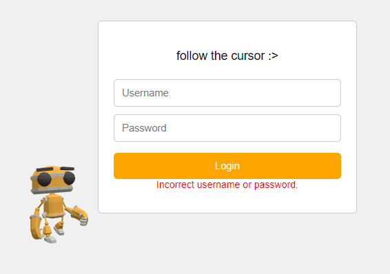

**X3D** is a flexible and reusable parent class designed to simplify the setup and management of 3D scenes using [Three.js](https://threejs.org/). It provides a structured approach for initializing scenes, handling rendering, resizing, and animating objects in a Three.js environment.

## Features

- **Scene Initialization**: Creates a Three.js scene and camera setup.
- **Customizable World**: Allows passing a custom function to build your 3D world.
- **Responsive Design**: Automatically handles window resizing to maintain correct aspect ratio and render size.
- **Animation Loop**: Provides an easy-to-use animation loop that automatically updates and renders the scene.
- **Update Functionality**: A default update function is provided that rotates objects in the scene. This can be overridden with a custom function.

## Installation

## Usage
Clone the repository and install the required dependencies (if any).
1. npm install
2. npm i vite --save-dev (or anything)
3. npx vite

## Initialize X3D with the container, world, and update function
// Get the container element
const container = document.getElementById('3d-container');

const x3d = new X3D(container, myWorld, myUpdate); or (extend it!)
x3d.load();
x3d.animate();
generate(): Appends the renderer's DOM element to the container.
resize(): Sets up the renderer size and handles window resizing.
animate(): Starts the animation loop, which calls the update() function before rendering each frame.
load(): Combines the resize and generate steps, and initializes the world.
update(): A default update function that rotates any mesh objects in the scene. This can be customized by passing a different update function when initializing the X3D class.

## License
This project is licensed under the MIT License.

## Author
Tariux

## Screenshot

